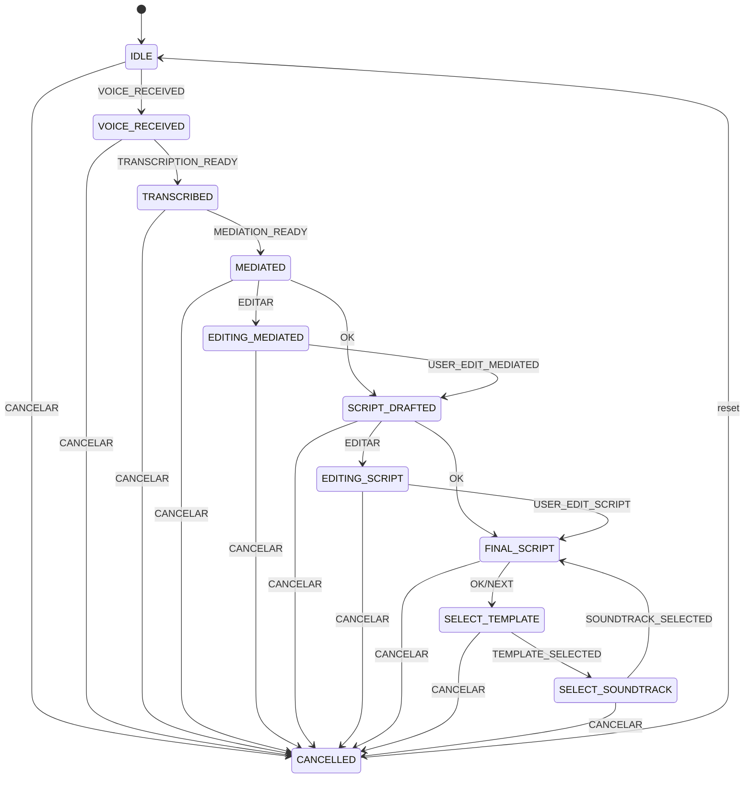

# EditorBot State Machine — Draft

Date: 2026-01-20

## Goal
Add a human-in-the-loop script generation flow:

Voice → Transcription → Dialect Mediation → User Edit → Script Generation → User Edit → Final Script

## States
| State | Description |
|---|---|
| IDLE | No active workflow. |
| VOICE_RECEIVED | Voice message received; file downloaded. |
| TRANSCRIBED | Whisper transcription complete. |
| MEDIATED | Dialect mediation complete. |
| EDITING_MEDIATED | User editing mediated text. |
| SCRIPT_DRAFTED | Script generated from mediated text. |
| EDITING_SCRIPT | User editing script draft. |
| FINAL_SCRIPT | Final script approved. |
| SELECT_TEMPLATE | User selects output template (long/short/reel/slides). |
| SELECT_SOUNDTRACK | User selects soundtrack (or none). |
| CANCELLED | User cancelled flow. |

## Events
| Event | Trigger | Notes |
|---|---|---|
| VOICE_RECEIVED | Voice message | Starts flow |
| TRANSCRIPTION_READY | Transcription produced | From Whisper |
| MEDIATION_READY | Mediation produced | From Gemini |
| USER_EDIT_MEDIATED | User sends edited mediated text | Goes to SCRIPT_DRAFTED |
| USER_OK_MEDIATED | User approves mediated text | Goes to SCRIPT_DRAFTED |
| SCRIPT_READY | Script generation produced | From LLM/template |
| USER_EDIT_SCRIPT | User sends edited script | Goes to FINAL_SCRIPT |
| USER_OK_SCRIPT | User approves script | Goes to FINAL_SCRIPT |
| TEMPLATE_SELECTED | Inline button callback | Moves to soundtrack selection |
| SOUNDTRACK_SELECTED | Inline button callback | Moves to final script |
| USER_CANCEL | Cancel command | Goes to CANCELLED |

## Commands (User)
| Command | Meaning |
|---|---|
| OK | Accept current draft |
| EDITAR | Start edit mode |
| CANCELAR | Cancel flow |
| NEXT | (Optional) advance to next stage |

## Inline buttons (Telegram)
After script approval, present inline buttons:

**Template buttons**
- Long (callback: `template:long`)
- Short (callback: `template:short`)
- Reel (callback: `template:reel`)
- Slides (callback: `template:slides`)

**Soundtrack buttons**
- None (callback: `music:none`)
- Lofi 1 (callback: `music:lofi1`)
- Lofi 2 (callback: `music:lofi2`)
- Corporate 1 (callback: `music:corp1`)

## Transitions (summary)
- IDLE → VOICE_RECEIVED (VOICE_RECEIVED)
- VOICE_RECEIVED → TRANSCRIBED (TRANSCRIPTION_READY)
- TRANSCRIBED → MEDIATED (MEDIATION_READY)
- MEDIATED → EDITING_MEDIATED (EDITAR)
- MEDIATED → SCRIPT_DRAFTED (OK)
- EDITING_MEDIATED → SCRIPT_DRAFTED (USER_EDIT_MEDIATED)
- SCRIPT_DRAFTED → EDITING_SCRIPT (EDITAR)
- SCRIPT_DRAFTED → FINAL_SCRIPT (OK)
- EDITING_SCRIPT → FINAL_SCRIPT (USER_EDIT_SCRIPT)
- FINAL_SCRIPT → SELECT_TEMPLATE (OK/NEXT)
- SELECT_TEMPLATE → SELECT_SOUNDTRACK (TEMPLATE_SELECTED)
- SELECT_SOUNDTRACK → FINAL_SCRIPT (SOUNDTRACK_SELECTED)
- Any → CANCELLED (CANCELAR)
- CANCELLED → IDLE (reset)

## Mermaid Diagram

## Implementation notes
- Keep the FSM pure (state + event → new state). External services should run outside transitions.
- Store intermediate text fields in conversation state: `transcript`, `mediated_text`, `script_draft`, `final_script`.
- Make `OK` act on the current stage, not global.
- Return user prompts at each stage (draft + instructions).
- Return user prompts at each stage (draft + instructions).
- Store selections in conversation state: `template_id`, `soundtrack_id`.
- Use inline keyboard callbacks to drive selection states.
